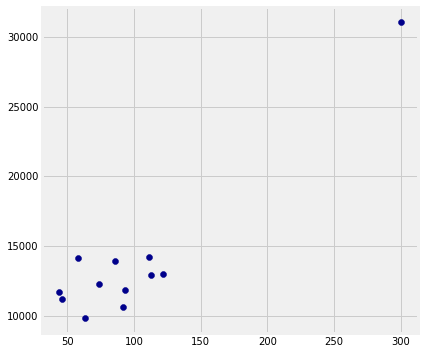

This page is largely derived from `Another_Kind_Of_Character` of the UC
Berkeley course \- see the license file on the main website.

In some situations, the relationships between quantities allow us to make
predictions. This text will explore how to make accurate predictions based on
incomplete information and develop methods for combining multiple sources of
uncertain information to make decisions.

As an example of visualizing information derived from multiple sources, let us
first use the computer to get some information that would be tedious to
acquire by hand. In the context of novels, the word "character" has a second
meaning: a printed symbol such as a letter or number or punctuation symbol.
Here, we ask the computer to count the number of characters and the number of
periods in each chapter of *Alice's Adventures in Wonderland*.


{:.input_area}
```python
# In each chapter, count the number of all characters;
# Also count the number of periods.
chars_periods = pd.DataFrame.from_dict({
        'Number of chars in chapter': [len(s) for s in alice_chapters],
        'Number of periods': np.char.count(alice_chapters, '.')
    })
```


Here are the data. Each row of the table corresponds to one chapter of the
novel and displays the number of characters as well as the number of periods
in the chapter. Not surprisingly, chapters with fewer characters also tend to
have fewer periods, in general – the shorter the chapter, the fewer sentences
there tend to be, and vice versa. The relation is not entirely predictable,
however, as sentences are of varying lengths and can involve other punctuation
such as question marks.


{:.input_area}
```python
chars_periods
```


<div markdown="0">
<div>
<style scoped>
    .dataframe tbody tr th:only-of-type {
        vertical-align: middle;
    }

    .dataframe tbody tr th {
        vertical-align: top;
    }

    .dataframe thead th {
        text-align: right;
    }
</style>
<table border="1" class="dataframe">
  <thead>
    <tr style="text-align: right;">
      <th></th>
      <th>Number of chars in chapter</th>
      <th>Number of periods</th>
    </tr>
  </thead>
  <tbody>
    <tr>
      <th>0</th>
      <td>11664</td>
      <td>44</td>
    </tr>
    <tr>
      <th>1</th>
      <td>11189</td>
      <td>46</td>
    </tr>
    <tr>
      <th>2</th>
      <td>9798</td>
      <td>63</td>
    </tr>
    <tr>
      <th>3</th>
      <td>14131</td>
      <td>58</td>
    </tr>
    <tr>
      <th>4</th>
      <td>12281</td>
      <td>74</td>
    </tr>
    <tr>
      <th>5</th>
      <td>14176</td>
      <td>111</td>
    </tr>
    <tr>
      <th>6</th>
      <td>13026</td>
      <td>122</td>
    </tr>
    <tr>
      <th>7</th>
      <td>13958</td>
      <td>86</td>
    </tr>
    <tr>
      <th>8</th>
      <td>12934</td>
      <td>113</td>
    </tr>
    <tr>
      <th>9</th>
      <td>11828</td>
      <td>93</td>
    </tr>
    <tr>
      <th>10</th>
      <td>10637</td>
      <td>92</td>
    </tr>
    <tr>
      <th>11</th>
      <td>31083</td>
      <td>300</td>
    </tr>
  </tbody>
</table>
</div>
</div>


In the plot below, there is a dot for each chapter in the book. The horizontal
axis represents the number of periods and the vertical axis represents the
number of characters.


{:.input_area}
```python
plt.figure(figsize=(6, 6))
plt.scatter(chars_periods['Number of periods'],
            chars_periods['Number of chars in chapter'],
            color='darkblue')
```


{:.output_data_text}
```
<matplotlib.collections.PathCollection at 0x108d96160>
```





Notice how the blue points are roughly clustered around a straight line.

Now look at all the chapters that contain about 100 periods. The plot shows
that those chapters contain about 10,000 characters to about 15,000
characters, roughly. That's about 100 to 150 characters per period.

Indeed, it appears from looking at the plot that the chapters tend to have
somewhere between 100 and 150 characters between periods, as a very rough
estimate. Perhaps these Lewis Carroll and Alice were announcing something
familiar to us now: the original 140-character limit of Twitter.
