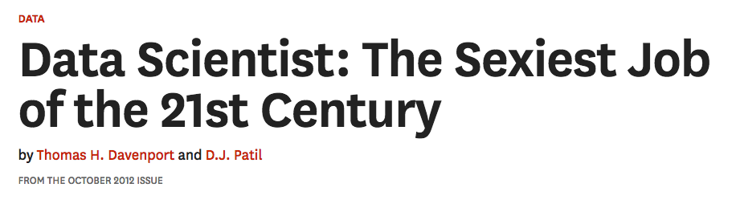

# What is data science?

## Data science is important

> ... academic institutions should encourage the development of a basic
> understanding of data science in all undergraduates -- A 2018 report from
> the US National Academies of Sciences, Engineering and Medicine.

## Data science is very important

> ... the really important intellectual event of the next fifty years"
> -- Donoho (2015) "50 years of data science".

## The data scientist

## A very brief history of data analysis

* Ronald Fisher and statistics
* John Tukey and data analysis

> Far better an approximate answer to the right question, which is often
> vague, than an exact answer to the wrong question, which can always be made
> precise.  J. W. Tukey (1962) "The future of data analysis".

## What is data science?

*   A new culture of data analysis.
*   Code as foundation;
*   Analysis becomes:
    *    versatile (big, messy, mixed, complex);
    *    realistic about the work of analysis (cleaning, exploring ...);
    *    collaborative;
    *    reproducible;
*   Emphasis on algorithms over mathematics for analysis and explanation.

## What's in data science?

*   Code!
*   Exploring data
*   Looking at data with graphs and pictures
*   Making and testing models (statistics, machine learning)
*   Predicting new data
