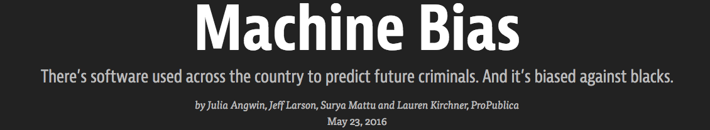

# Why study data science?

## You can study a wider variety of data

* Everything that you can store on your computer.
* Numbers, but also text, pictures, music, speech, video.
* Tweets, Facebook posts, social networks, emails.
* Understanding other fields through data.

## You will be better at understanding data

## You will be a better citizen

Cambridge Analytica
